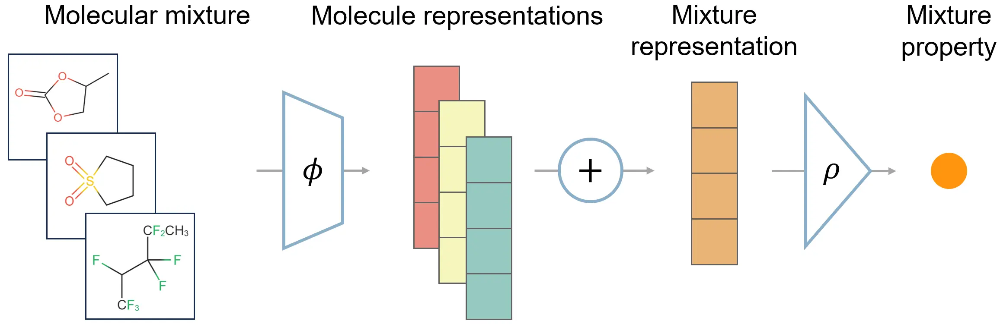

# Molecular Graph Deep Sets

[](https://zenodo.org/doi/10.5281/zenodo.11068425)

This repository contains an implementation of the molecular graph deep sets (MolSets) model for molecular mixture properties, associated with our paper [Learning molecular mixture property using chemistry-aware graph neural network](https://doi.org/10.1103/PRXEnergy.3.023006).



## Descriptions
`models.py` and `dmpnn.py` contain implementations of MolSets with standard graph convolutions and [DMPNN](https://github.com/itakigawa/pyg_chemprop), respectively.

`main.py`, `main_dmpnn.py`, and `predict.py` are for evaluation and prediction; see [Usage](#Usage) for details.

`data_utils.py` is for processing molecular graph data.

`data/` provides datasets used in the paper. 

<details>
  <summary>
    Details on datasets:
  </summary>
  
- `data_list.pkl` contains processed data from the dataset curated in [*ACS Cent. Sci.* 2023, 9, 2, 206–216](https://doi.org/10.1021/acscentsci.2c01123).
  - An integer index;
  - A list of solvent molecular graphs in `torch_geometric.data.Data` format;
  - A list of solvent molecular weights (g/mol);
  - A list of solvent weight fractions;
  - Salt molality (mol/kg);
  - Salt molecular graph;
  - Logarithm conductivity at 298 K (log S/cm).
- `data_df_stats.pkl` organizes the data with some statistics in `pandas.DataFrame` format.
- `all_bin_candidates.pkl` contains the candidates (equal weight binary molecular mixture + 1 m salt) for virtual screening. Organized in the same way as `data_list.pkl`.
  </details>
  
`results` provides model checkpoints and saves files generated in runs.

*Note: [Git LFS](https://git-lfs.com/) is required to download the `.pkl` files properly. Please download them manually if you do not have Git LFS.

**Data handling is not yet optimized for efficiency. Contributions are welcome!

## Requirements
MolSets requires the following packages:
- PyTorch >= 2.0
- PyG (`torch_geometric`)
- PyTorch Scatter (only for DMPNN)

The environment can be set up by running
```
conda env create -f environment.yml
```
However, there may be package compatibility issues that need manual corrections. CUDA and GPU-enabled versions of PyTorch and PyG are required to run on GPUs.

## Usage
### Evaluation
Use `main.py` to train the MolSets model (with standard graph convolutions) or evaluate it on a dataset. Set the hyperparameters in `hyperpars`, and the data path in `dataset`, then run
```
(screen) python main.py
```
and see the results. Training may take minutes to hours depending on the device and data size. For the model with DMPNN, use `main_dmpnn.py` instead, following similar procedures.

### Inference
Use `predict.py` to make inferences on candidate mixtures with a trained model. Specify the path to the candidate data file in `candidate_data` and the model checkpoint file in `model.load_`. Information about training data is needed if feature normalization is used, as in `data_utils.py`.
After setup, run
```
python predict.py
```
and the predictions will be written in a `.csv` file.

## Citation
If you find this code useful, please consider citing the following paper:
```
@article{zhang2024molsets,
   author = {Zhang, Hengrui and Lai, Tianxing and Chen, Jie and Manthiram, Arumugam and Rondinelli, James M. and Chen, Wei},
   title = {Learning molecular mixture property using chemistry-aware graph neural network},
   journal = {PRX Energy},
   year = {2024},
   volume = {3},
   number = {2},
   pages = {023006},
   doi = {10.1103/PRXEnergy.3.023006}
}
```
